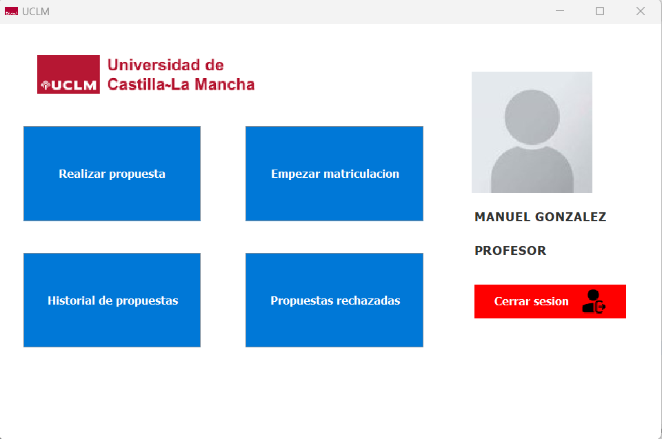

# Manual de usuario-Prácticas ISO II
## Índice
1. [Usuarios de prueba](#usuarios)
2. [Login](#login)
3. [Interfaz profesor](#profesor)
4. [Interfaz vicerrector](#vicerrector)
5. [Interfaz estudiante](#estudiante)
6. [Interfaz jefe gabinete](#jefe)

## Usuarios de prueba
### Usuario de tipo: Profesor
Usuario:profesor

Contraseña:profesor
### Usuario de tipo: Vicerrector
Usuario:vicerrector

Contraseña:vicerrector
### Usuario de tipo: Estudiante
Usuario:estudiante

Contraseña:estudiante
### Usuario de tipo: Jefe Gabinete
Usuario:jefe

Contraseña:jefe

## Login
Debe introducir los usuarios y contraseñas anteriores dependiendo del tipo de usuario que se quiera iniciar.

## Interfaz profesor
Una vez identificado como profesor, aparecen las opciones de "Realizar propuesta" (crear cursos), "Empezar matriculación"(comenzar la matriculación una vez el vicerrector acepte el curso ), "Historial de propuestas"(todas las propuestas realizadas por dicho profesor) y "Propuestas rechazadas"(propuestas que han sido rechazadas por el vicerrector).

## Interfaz vicerrector
Una vez identificado como vicerrector, aparece la opcion de "Cursos propuestos" (aceptar o rechazar cursos propuestos por el profesor).

## Interfaz estudiante
Una vez identificado como estudiante, aparecen las opciones de "Realizar matriculación" (matricularse en algun curso en matriculación) y "Mis cursos" (ver los cursos en los que se ha matriculado).

## Interfaz jefe gabinete
Una vez identificado como jefe, aparecen las opciones de "Estadisticas cursos" (resumen de estadisticas de todos los cursos)  y "Comenzar cursos" (se comienzan a impartir los cursos en matriculación).

