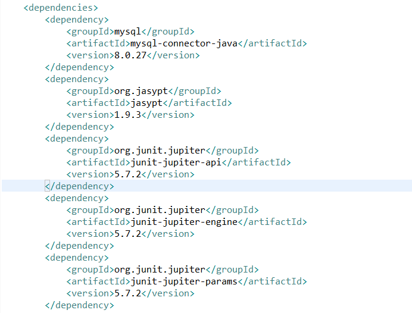
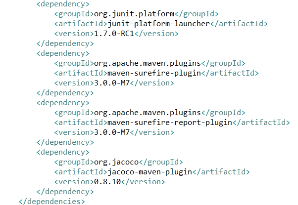
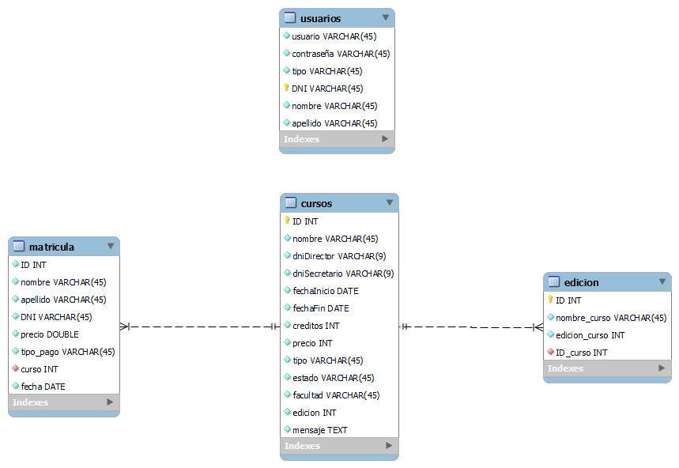
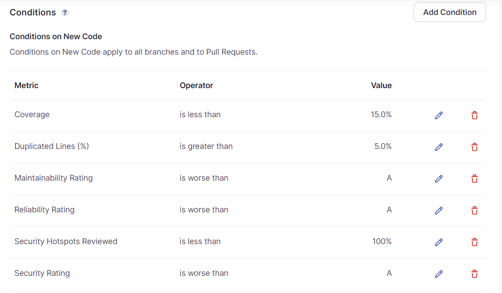

# RevivingSoftware-Prácticas ISO II
## Índice
1. [Introducción](#introducción)
2. [Planificación y gestión](#planificacion)
    - [2.1. Sprint1](#sprint1)
    - [2.2. Sprint2](#sprint2)
    - [2.3. Sprint3](#sprint3)
    - [2.4. Sprint4](#sprint4)
    - [2.5. Sprint5](#sprint5)
3. [Codificación](#codificacion)
4. [Configuración](#configuracion)
5. [Calidad](#calidad)
6. [Testing](#testing)
7. [Mantenimiento](#mantenimiento)

## Introducción
Aquí puedes proporcionar una breve introducción a tu proyecto y a la memoria. Puedes explicar el contexto, los objetivos y cualquier otra información relevante.

## Planificación y gestión
Para la planificación y gestión del proyecto se ha seguido una metodología agil basada en Scrum. Se han realizado 5 sprints en total que se explicarán a continuación. Cabe destacar que se ha realizado la planificación de dichos sprints mediante la herramienta online "Trello".
### Sprint1
Su objetivo principal era la configuración del proyecto y avance en la capa "Presentación". Se realizo en unas fechas comprendidas entre el día 01-03-2023 y el día 22-03-2023. En general los objetivos fueron completados, aunque el avance en la capa "Presentación" no fue muy significativo.

Se puede ver el avance del sprint paso a paso pulse este [enlace](https://github.com/ivaann17/RevivingSoftware/tree/Release/SPRINTS/SPRINT%201)

Para mayor información del sprint en Trello pulse este [enlace](https://trello.com/b/jVvZVQfw/sprint-1)
### Sprint2
Su objetivo principal era la finalización de la capa "Presentación y la creación del "Plan de Gestión de la Configuración". Se realizo en unas fechas comprendidas entre el día 23-03-2023 y el día 13-04-2023. En general los objetivos no fueron completados debido a la carga de trabajo en dicho periodo del sprint y la imposibilidad de trabajar en este proyecto.

Se puede ver el avance del sprint paso a paso pulse este [enlace](https://github.com/ivaann17/RevivingSoftware/tree/Release/SPRINTS/SPRINT%202)

Para mayor información del sprint en Trello pulse este [enlace](https://trello.com/b/Xp75PwJj/sprint-2)
### Sprint3
Su objetivo principal era avanzar en el retraso producido en el sprint 2. Se realizo en unas fechas comprendidas entre el día 14-04-2023 y el día 05-05-2023. En general los objetivos fueron completados de forma satisfactoria aunque aun quedaron para el siguiente sprint las dos tareas del sprint2: "Creación base de datos (tarea continua)" y "Creación del Plan de Gestión de la Configuración".

Se puede ver el avance del sprint paso a paso pulse este [enlace](https://github.com/ivaann17/RevivingSoftware/tree/Release/SPRINTS/SPRINT%203)

Para mayor información del sprint en Trello pulse este [enlace](https://trello.com/b/MsY4DWdP/sprint-3)
### Sprint4
Su objetivo principal era la finalización del proyecto. Se realizo en unas fechas comprendidas entre el día 08-05-2023 y el día 20-05-2023. En general los objetivos fueron completados pero no se pudieron realizar de forma completa los últimos pasos del proyecto, como el testing o la gestión de la calidad.

Se puede ver el avance del sprint paso a paso pulse este [enlace](https://github.com/ivaann17/RevivingSoftware/tree/Release/SPRINTS/SPRINT%204)

Para mayor información del sprint en Trello pulse este [enlace](https://trello.com/b/kiRyT5mS/sprint-4)
### Sprint5
Su objetivo principal era de nuevo la finalización del proyecto completo. Se realizo en unas fechas comprendidas entre el día 22-05-2023 y el día 06-06-2023. Los objetivos fueron completados y el proyecto finalizado de forma correcta.

Se puede ver el avance del sprint paso a paso pulse este [enlace](https://github.com/ivaann17/RevivingSoftware/tree/Release/SPRINTS/SPRINT%205)

Para mayor información del sprint en Trello pulse este [enlace](https://trello.com/b/XRbclyOe/sprint-5)

## Codificación
El proyecto esta comprendido en tres capas: negocio, persistencia y presentación. En la capa de negocio se encuentran los gestores y entidades del software. En la capa de persistencia se encuentran las clases que hacen de enlace entre la base de datos y el software. En la capa de presentación se encuentran todas las interfaces gráficas (GUIs).

Se puede observar la estructura y el código en el siguiente [enlace](https://github.com/ivaann17/RevivingSoftware/tree/Release/src)

## Configuración
En cuanto a la gestión de la configuración del proyecto, en primer lugar cabe destacar que se ha creado un "Plan de Gestión de la Configuración" que se puede revisar en el siguiente [enlace](https://github.com/ivaann17/RevivingSoftware/tree/Release/PLAN%20DE%20GESTI%C3%93N%20DE%20CONFIGURACI%C3%93N).

El proyecto se ha gestionado en GitHub con la creación de diferentes ramas para dividir el trabajo.

La construcción del software se ha realizado utilizando la herramienta Maven y a través del archivo pom.xml. Las dependencias utilizadas en el proyecto son las siguientes:

En cuanto a la base de datos, se ha creado una base de datos online mediante db4free y phpMyAdmin. Al no ser el objetivo fundamental de dicho proyecto, se trata de una base de datos muy simplificada y creada de forma rápida. Su esquema es el siguiente:

## Calidad
La gestión de la calidad se ha realizado mediante la herramienta SonarCloud. Se ha creado una automatización en la realización de analisis de calidad al realizar commits y pull requests.

Las metricas para nuestro analisis de calidad son las siguientes: 

## Testing
Para la realización de pruebas de software se ha seguido lo estipulado en el [Plan de Pruebas](https://github.com/ivaann17/RevivingSoftware/tree/Release/PLAN%20DE%20PRUEBAS) creado. Se realizan mediante "JUnit5" y también utilizando el plugin de Eclipse "MoreUnit". El código para la realización de test se aloja en el paquete test.java.negocio.

Por otra parte, se genera de forma automatica un informe (target/site) sobre el proyecto mediante la herramienta de "Surefire" y también en particular sobre los test con la herramienta de cobertura de "Jacoco". El informe se puede observar en este [enlace](PLAN DE PRUEBAS) 

## Mantenimiento
El mantenimiento se ha realizado de forma conjunta a la gestión de la calidad principalmente mediante la eliminación de code smells, tanto en la parte del codigo como en los test. En la siguiente imagen se puede observar la clara disminución de los code smells durante el tiempo.

